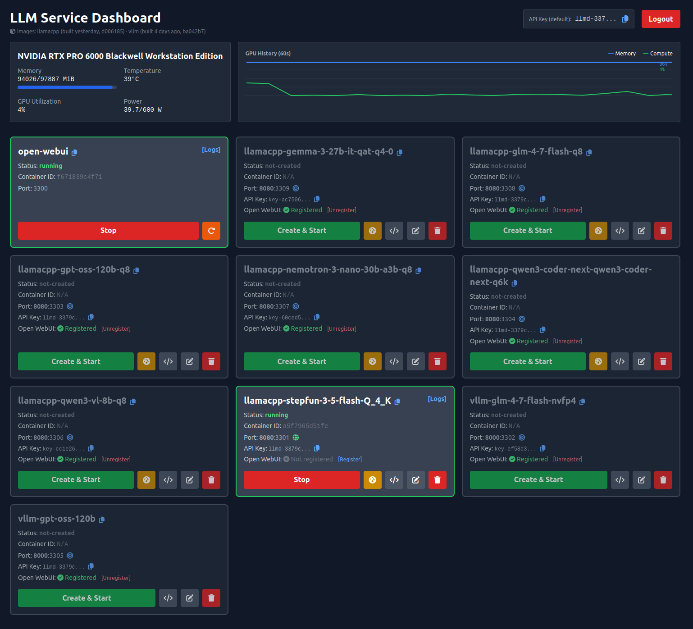
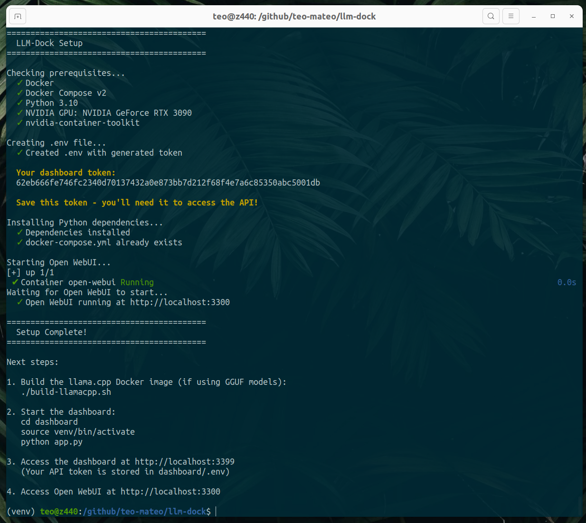
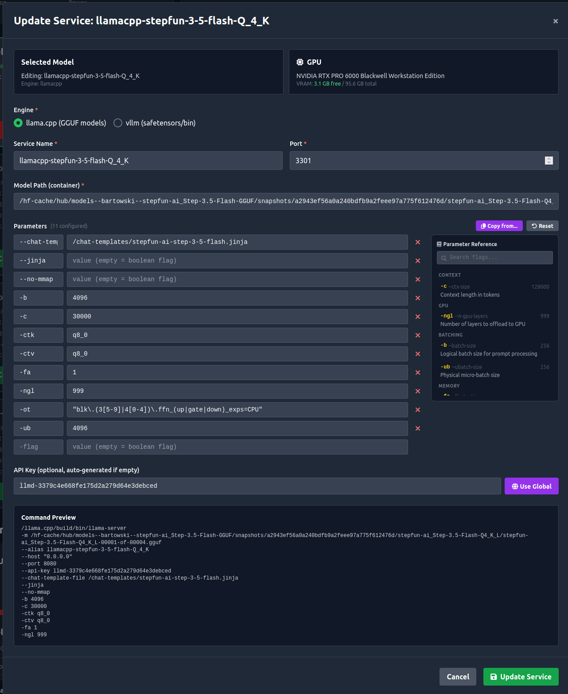
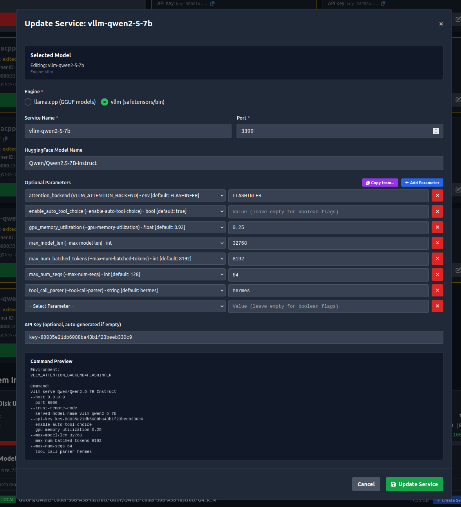

# LLM-Dock

A dashboard for managing local LLM inference services with Docker Compose. Supports llama.cpp (GGUF models) and vLLM (HuggingFace models) with automatic GPU detection, model discovery, and Open WebUI integration.



See [CHANGELOG.md](CHANGELOG.md) for version history.

## Features

- **Model Discovery** - Automatically scans HuggingFace cache and local directories for models
- **Multi-Engine Support** - llama.cpp for GGUF models, vLLM for safetensors/HuggingFace models
- **GPU Monitoring** - Real-time nvidia-smi stats in the dashboard
- **Service Management** - Create, start, stop, restart services via web UI or API
- **Open WebUI Integration** - Auto-registers services as OpenAI-compatible endpoints
- **Port Management** - Automatic port assignment in the 3300-3400 range
- **Benchmarking** - Run `llama-bench` directly from the dashboard against any llama.cpp service. Benchmarks inherit the service's model and parameters, with live output streaming. Results are stored in a local database for history tracking and comparison across runs

## Prerequisites

- Linux (tested on Ubuntu 22.04)
- Docker with Compose v2 (`docker compose`, not `docker-compose`)
- Python 3.10+
- NVIDIA GPU with CUDA drivers
- nvidia-container-toolkit

### Tested On

| OS | GPU | CUDA Arch |
|----|-----|-----------|
| Ubuntu 22.04.5 LTS | RTX PRO 6000 Blackwell | 120 |
| Ubuntu 22.04.5 LTS | RTX 3090 | 86 |

## Quick Start

Before running setup, ensure the following are installed and configured:

- **Docker Engine with Compose v2** - The setup script uses `docker compose` (not the legacy `docker-compose`). Install from [Docker's official repository](https://docs.docker.com/engine/install/ubuntu/) for the latest version.
- **Docker group membership** - Your user must be in the `docker` group (`sudo usermod -aG docker $USER`, then log out and back in) or `./build-llamacpp.sh` will fail with permission errors.
- **Python venv** - On Ubuntu, the `python3.10-venv` (or equivalent) package is required. Without it, `./setup.sh` cannot create the virtual environment.
- **NVIDIA Container Toolkit** - Required for GPU passthrough into Docker containers. Install from [NVIDIA's repository](https://docs.nvidia.com/datacenter/cloud-native/container-toolkit/latest/install-guide.html) and restart Docker afterwards.

```bash
# Clone the repository
git clone https://github.com/teo-mateo/llm-dock.git
cd llm-dock

# Run setup (creates venv, installs deps, generates password, starts Open WebUI)
./setup.sh

# Build llama.cpp Docker image (if using GGUF models)
./build-llamacpp.sh

# Start the dashboard
cd dashboard
source venv/bin/activate
python app.py
```

Here's what a successful setup looks like:



**Access points:**
- Dashboard: http://localhost:3399
- Open WebUI: http://localhost:3300

## Getting Started with Your First Model

If you don't have any models yet, here's how to download a small (~2GB) but capable model to get started.

### 1. Install huggingface-cli

```bash
pip install huggingface-hub
```

The `huggingface-cli` (or `hf`) command may be installed to `~/.local/bin/`. If not found, either use `~/.local/bin/huggingface-cli` directly or add `export PATH="$HOME/.local/bin:$PATH"` to your shell profile.

### 2. Download a Starter Model

We recommend **Qwen2.5-3B-Instruct** in GGUF format - it's small, fast, and surprisingly capable:

```bash
# Download Q4_K_M quantization (~2GB, good balance of size/quality)
hf download Qwen/Qwen2.5-3B-Instruct-GGUF qwen2.5-3b-instruct-q4_k_m.gguf
```

Alternative smaller/larger options:
```bash
# Smaller (~1.5GB) - faster but less capable
hf download Qwen/Qwen2.5-1.5B-Instruct-GGUF qwen2.5-1.5b-instruct-q4_k_m.gguf

# Larger (~4.5GB) - more capable
hf download Qwen/Qwen2.5-7B-Instruct-GGUF qwen2.5-7b-instruct-q4_k_m.gguf
```

### 3. Build llama.cpp and Start the Dashboard

```bash
# Build llama.cpp Docker image (select your GPU architecture when prompted)
./build-llamacpp.sh

# Start the dashboard
cd dashboard
source venv/bin/activate
python app.py
```

### 4. Create a Service via the Dashboard

1. Open http://localhost:3399 in your browser
2. The model should appear in the "Discovered Models" section
3. Click on it and select **llama.cpp** as the engine
4. Configure parameters using the inline reference panel (defaults work fine for the 3B model):
   - `-c 8192` (context length, up to `32768` for Qwen2.5)
   - `-ngl 99` (offload all layers to GPU)
5. Click **Create Service**
6. Click **Start** to launch it

### 5. Chat with Your Model

- **Via Open WebUI**: Go to http://localhost:3300, your model will be auto-registered
- **Via API**:
  ```bash
  curl http://localhost:3301/v1/chat/completions \
    -H "Authorization: Bearer YOUR_API_KEY" \
    -H "Content-Type: application/json" \
    -d '{
      "model": "qwen2.5-3b-instruct",
      "messages": [{"role": "user", "content": "Hello!"}]
    }'
  ```

## Project Structure

```
llm-dock/
├── setup.sh                    # Initial setup script
├── start.sh                    # Quick start script
├── build-llamacpp.sh           # Build llama.cpp Docker image
├── build-vllm.sh               # Build vLLM Docker image
├── docker-compose.yml          # Docker Compose configuration (generated)
│
├── dashboard/
│   ├── app.py                  # Flask API server
│   ├── compose_manager.py      # Docker Compose management
│   ├── flag_metadata.py        # Engine flag definitions & validation
│   ├── model_discovery.py      # Model scanning
│   ├── service_templates.py    # Service generators
│   ├── openwebui_integration.py
│   ├── requirements.txt
│   ├── .env.example
│   ├── benchmarking/           # Benchmark subsystem
│   │   ├── routes.py           # Benchmark API endpoints
│   │   ├── executor.py         # llama-bench runner
│   │   ├── db.py               # Benchmark results storage
│   │   └── validators.py       # Input validation
│   ├── templates/              # Jinja2 service templates
│   │   ├── llamacpp.j2
│   │   └── vllm.j2
│   └── static/                 # Frontend
│       ├── index.html          # Main dashboard
│       ├── app.js              # Dashboard logic
│       └── benchmark.html      # Benchmark UI
│
├── llama.cpp/
│   └── Dockerfile              # Custom llama.cpp build
│
└── vllm/
    └── Dockerfile              # Custom vLLM build
```

## Configuration

### Environment Variables

Copy `.env.example` to `.env` in the dashboard directory:

```bash
cd dashboard
cp .env.example .env
```

| Variable | Description | Default |
|----------|-------------|---------|
| `DASHBOARD_TOKEN` | Dashboard password | (required) |
| `DASHBOARD_PORT` | Dashboard port | 3399 |
| `DASHBOARD_HOST` | Dashboard bind address | 0.0.0.0 |
| `COMPOSE_PROJECT_NAME` | Docker project name | llm-dock |
| `COMPOSE_FILE` | Path to docker-compose.yml | ../docker-compose.yml |
| `LOG_LEVEL` | Logging level | INFO |

### Model Paths

The dashboard automatically scans:
- `~/.cache/huggingface/hub/` - HuggingFace cache
- `~/.cache/models/` - Generic GGUF directory

To add custom paths, modify `model_discovery.py`.

## API Reference

All endpoints (except `/api/health`) require Bearer token authentication:

```bash
curl -H "Authorization: Bearer YOUR_PASSWORD" http://localhost:3399/api/services
```

### Endpoints

| Endpoint | Method | Description |
|----------|--------|-------------|
| `/api/health` | GET | Health check (no auth) |
| `/api/gpu` | GET | GPU statistics |
| `/api/system/info` | GET | System info + discovered models |
| `/api/services` | GET | List all services |
| `/api/services/<name>/start` | POST | Start a service |
| `/api/services/<name>/stop` | POST | Stop a service |
| `/api/services/<name>/restart` | POST | Restart a service |
| `/api/services/<name>/logs` | GET | Get service logs |
| `/api/services/create` | POST | Create a new service |
| `/api/v2/services/<name>` | GET | Get service config |
| `/api/v2/services/<name>` | PUT | Update service |
| `/api/v2/services/<name>` | DELETE | Delete service |
| `/api/v2/flag-metadata/<type>` | GET | Get engine flags |

### Creating a Service

```bash
curl -X POST http://localhost:3399/api/v2/services \
  -H "Authorization: Bearer YOUR_PASSWORD" \
  -H "Content-Type: application/json" \
  -d '{
    "template_type": "llamacpp",
    "port": 3301,
    "model_path": "/hf-cache/hub/.../model.gguf",
    "alias": "qwen2.5-7b",
    "params": {
      "-c": "32000",
      "-ngl": "99",
      "-fa": "1"
    }
  }'
```

## Supported Engines

### llama.cpp
- Format: GGUF files
- Multimodal: Supported (mmproj files)
- Image: Custom build (`llm-dock-llamacpp`)
- Benchmarking: Built-in `llama-bench` support from the dashboard



Parameters are configured as CLI flags directly (e.g. `-ngl 99`, `-fa 1`). The editor includes an inline reference panel with tooltips for all supported flags. Common flags:
- `-c` - Context length
- `-ngl` - GPU layers (99 = all)
- `-b` / `-ub` - Batch / micro-batch size
- `-fa` - Flash attention
- `-ctk` / `-ctv` - KV cache quantization
- `-t` - Thread count
- `-sm` - Multi-GPU split mode
- `-ts` - Tensor split ratios
- `-ot` - Override tensor buffer types (for MoE models)

### vLLM
- Format: safetensors (HuggingFace models)
- Image: `vllm/vllm-openai:v0.11.0`



Available flags:
- `--max-model-len` - Context length
- `--gpu-memory-utilization` - GPU memory fraction
- `--max-num-batched-tokens` - Batch size
- `--max-num-seqs` - Max concurrent sequences
- `--enable-prefix-caching` - Prefix caching
- `--tensor-parallel-size` - Multi-GPU support

## Building llama.cpp

The `build-llamacpp.sh` script builds a custom llama.cpp Docker image optimized for your GPU:

```bash
./build-llamacpp.sh
```

The script will:
1. Detect your GPU and suggest the optimal CUDA architecture
2. Prompt for confirmation or manual override
3. Build the Docker image (~10-15 minutes)

### CUDA Architectures

| Architecture | GPUs |
|--------------|------|
| 120 | RTX 50 series (Blackwell) |
| 90 | H100, H200 (Hopper) |
| 89 | RTX 40 series (Ada Lovelace) |
| 86 | RTX 30 series, A100, A10 (Ampere) |
| 75 | RTX 20 series, T4 (Turing) |
| 70 | V100 (Volta) |
| 61 | GTX 10 series (Pascal) |

Find your GPU's compute capability: https://developer.nvidia.com/cuda-gpus

## Running as a System Service

Create `/etc/systemd/system/llm-dock.service`:

```ini
[Unit]
Description=LLM-Dock Dashboard
After=network.target docker.service

[Service]
Type=simple
User=YOUR_USER
WorkingDirectory=/path/to/llm-dock/dashboard
Environment=PATH=/path/to/llm-dock/dashboard/venv/bin:/usr/bin
ExecStart=/path/to/llm-dock/dashboard/venv/bin/python app.py
Restart=on-failure

[Install]
WantedBy=multi-user.target
```

Then:
```bash
sudo systemctl daemon-reload
sudo systemctl enable llm-dock
sudo systemctl start llm-dock
```

## Troubleshooting

### "could not select device driver nvidia" / "nvidia-container-toolkit not detected"
Install the NVIDIA Container Toolkit:
```bash
# Add NVIDIA repo
curl -fsSL https://nvidia.github.io/libnvidia-container/gpgkey | sudo gpg --dearmor -o /usr/share/keyrings/nvidia-container-toolkit-keyring.gpg
curl -s -L https://nvidia.github.io/libnvidia-container/stable/deb/nvidia-container-toolkit.list | \
  sed 's#deb https://#deb [signed-by=/usr/share/keyrings/nvidia-container-toolkit-keyring.gpg] https://#g' | \
  sudo tee /etc/apt/sources.list.d/nvidia-container-toolkit.list

# Install and configure
sudo apt-get update && sudo apt-get install -y nvidia-container-toolkit
sudo nvidia-ctk runtime configure --runtime=docker
sudo systemctl restart docker
```

### Services not starting
Check Docker logs:
```bash
docker compose logs <service-name>
```

### GPU not detected in container
Verify nvidia-smi works in Docker:
```bash
docker run --rm --gpus all nvidia/cuda:12.0-base nvidia-smi
```

## License

MIT License - see [LICENSE](LICENSE) file.
