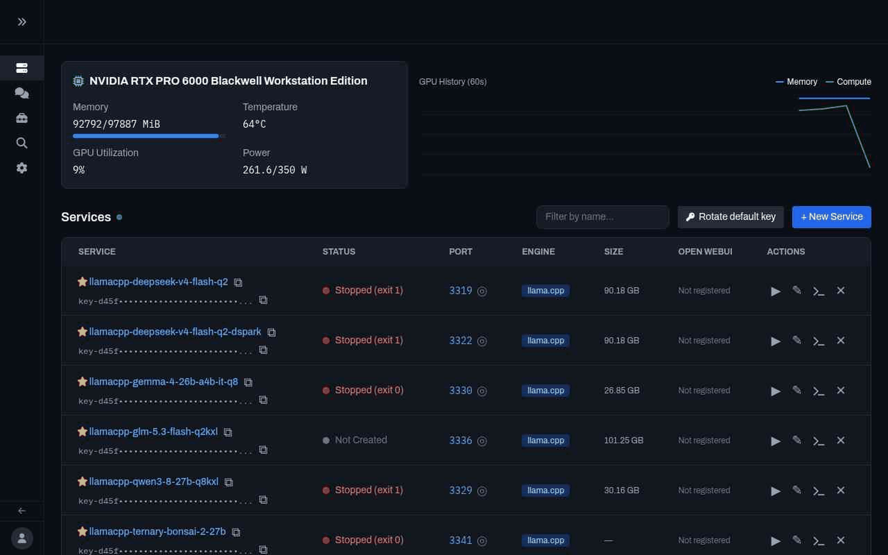
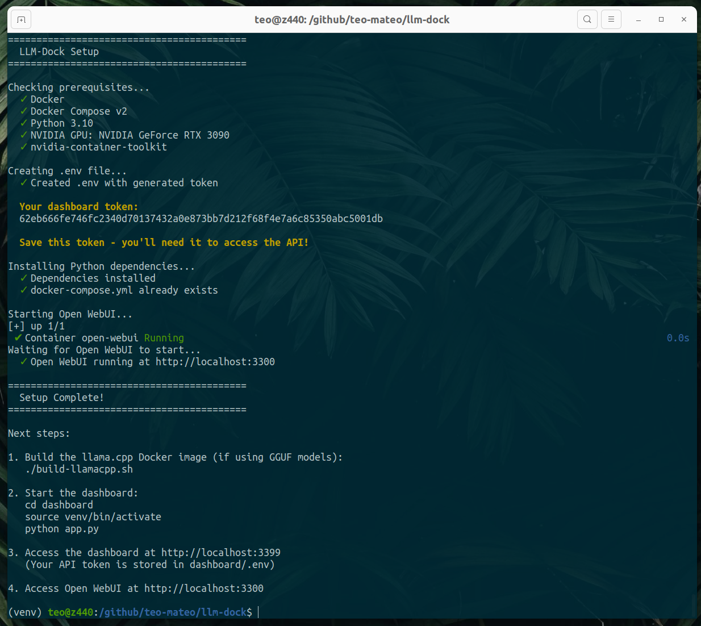
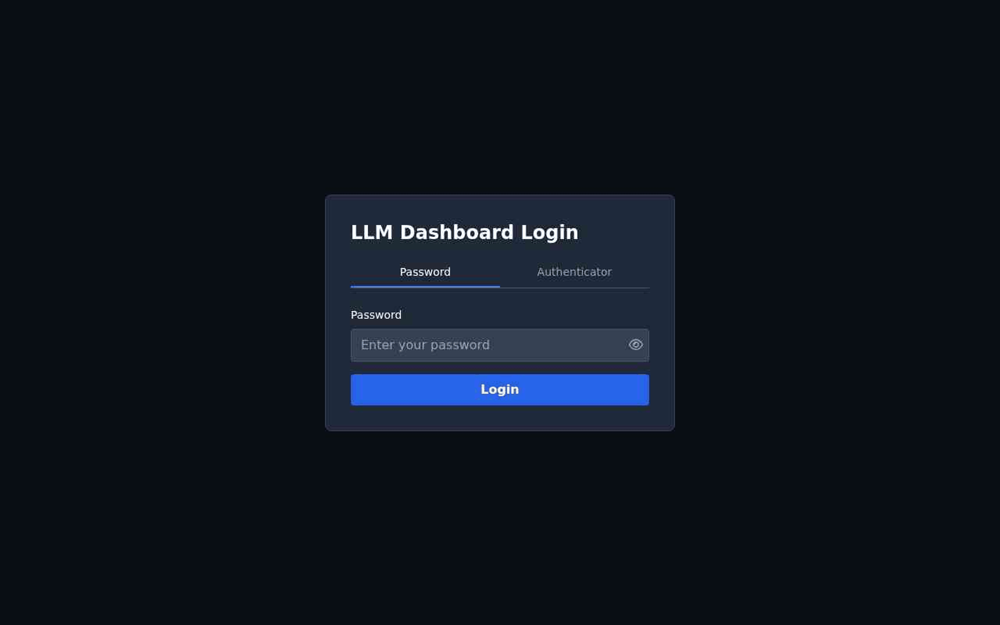
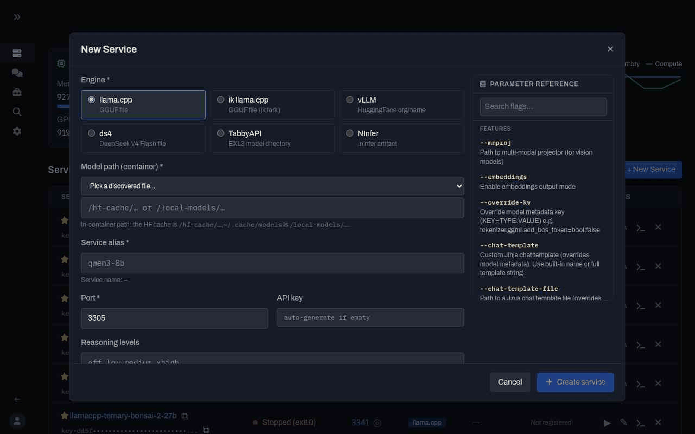
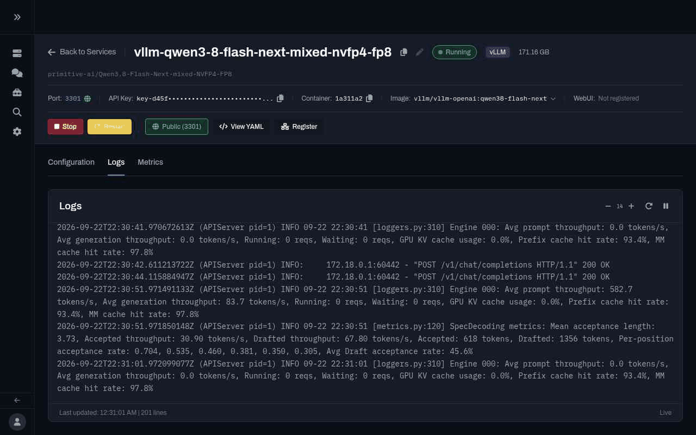
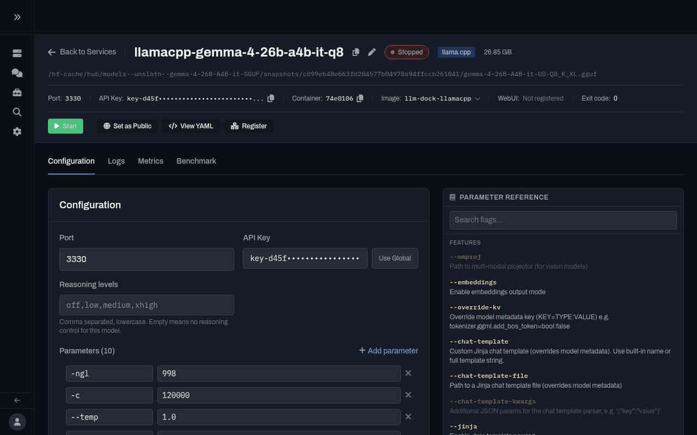

# LLM-Dock

A dashboard for running local LLM inference services out of Docker Compose: it discovers
the models you already have on disk, generates and maintains the compose file for you, and
gives every service a port, an API key, a live metrics panel and a captured request log.
Six inference engines are first-class, and a full chat UI (plus an Android client) talks to
them through one OpenAI-compatible surface.



*API keys are masked in the screenshots of this README; the dashboard shows them in full.*

## Features

- **Six inference engines** - llama.cpp, ik_llama.cpp, vLLM, ds4, TabbyAPI (EXL3) and NInfer, each with its own compose template, flag reference and build script
- **Model discovery** - scans the HuggingFace cache and `~/.cache/models`, translates host paths into the paths containers see, and offers each file in the create-service dialog
- **Service management** - create, rename, start, stop, restart, delete; live status over SSE; per-service container logs with a live tail; compose YAML preview before you commit a change
- **GPU monitoring** - live memory / utilisation / temperature / power plus a 60-second history chart
- **Live metrics** - Prometheus scrape per service where the engine exposes one (vLLM, llama.cpp, NInfer): running/waiting requests, token throughput, KV-cache usage, prefix-cache hits, speculative-decode acceptance
- **Benchmarking** - run `llama-bench` from the dashboard against any llama.cpp service, with live output, stored history, and one click to apply the winning flags back to the service
- **Built-in chat** - streaming conversations with reasoning levels, per-conversation sampling parameters, projects with a shared file workspace, tool calling over MCP, and a zero-trace **ghost chat** mode
- **Request inspector** - toggle it on a service and a capturing proxy takes over its public port: every inference request and response (stream assembled), credentials redacted in storage only
- **Open WebUI integration** - register or unregister a service as an OpenAI-compatible endpoint from the service page
- **MCP tool servers** - built-ins for SymPy, circuit drawing, HTML rendering and project files, plus external stdio/HTTP servers declared in a JSON file
- **Auth** - bearer tokens with an 8-hour sliding session, optional TOTP login, and one-click rotation of the shared default API key

**Access points**

| | |
|---|---|
| Dashboard (legacy UI) | http://localhost:3399 |
| Dashboard (React v2) | http://localhost:3399/v2 |
| Open WebUI | http://localhost:3300 |
| Model services | `3301`-`3399` (`3301` is the public slot) |

See [CHANGELOG.md](CHANGELOG.md) for version history, and [AGENTS.md](AGENTS.md) for the
full working guide (subsystem map, gotchas, per-engine rules) if you are going to hack on it.

## Prerequisites

- Linux (tested on Ubuntu 22.04)
- Docker Engine with Compose v2 (`docker compose`, not the legacy `docker-compose`)
- Your user in the `docker` group (`sudo usermod -aG docker $USER`, then re-login)
- Python 3.10+ with the `python3-venv` package
- NVIDIA GPU with CUDA drivers
- nvidia-container-toolkit

### Tested On

| OS | GPU | CUDA Arch |
|----|-----|-----------|
| Ubuntu 22.04.5 LTS | RTX PRO 6000 Blackwell | 120 |
| Ubuntu 22.04.5 LTS | RTX 3090 | 86 |

## Quick Start

NVIDIA Container Toolkit needs to be registered with Docker once:

```bash
sudo nvidia-ctk runtime configure --runtime=docker
sudo systemctl restart docker
```

```bash
# Clone the repository
git clone https://github.com/teo-mateo/llm-dock.git
cd llm-dock

# Create the venv, install deps, generate credentials, start Open WebUI
./setup.sh

# Build the llama.cpp image (if you plan to use GGUF models)
./build-llamacpp.sh

# Start the dashboard
cd dashboard
source venv/bin/activate
python app.py
```

Here's what a successful setup looks like:



`setup.sh` writes `dashboard/.env` with `DASHBOARD_TOKEN` (the login password) and
`LLM_DOCK_API_KEY` (the default key mirrored into every service). Open
http://localhost:3399 and sign in with that password.



Two things worth knowing about auth:

- The login page has a second tab, **Authenticator**, which takes a 6-digit TOTP code once
  you have enrolled one (Settings → TOTP). Both tabs hand back the same 8-hour bearer
  token, which slides forward on every authenticated request.
- Session tokens live in dashboard process memory, so restarting the dashboard invalidates
  them. The password does not change.

Everything under `/api` is bearer-authed except `/api/health` and the two token-issuing
endpoints, so `curl` clients send `Authorization: Bearer <DASHBOARD_TOKEN>` too.

## Adding Your First Service

### 1. Get a model on disk

The dashboard reads the HuggingFace cache, so anything `hf` downloads shows up as a
discovered model. A small but capable GGUF to start with:

```bash
pip install huggingface-hub
hf download Qwen/Qwen2.5-3B-Instruct-GGUF qwen2.5-3b-instruct-q4_k_m.gguf
```

(`hf` usually lands in `~/.local/bin`; add it to `PATH` or call it by full path.)

Alternatives: `Qwen/Qwen2.5-1.5B-Instruct-GGUF` (~1.5 GB, faster) or
`Qwen/Qwen2.5-7B-Instruct-GGUF` (~4.5 GB, more capable). For vLLM, download a safetensors
checkpoint instead, e.g. `hf download Qwen/Qwen2.5-3B-Instruct`.

### 2. Create the service

Click **+ New Service**. Pick the engine, then pick the discovered file (or type the
in-container path yourself - `/hf-cache/...` and `/local-models/...` both work). The alias
and port are filled in for you, and a parameter reference panel documents every flag that
engine understands.



Defaults are sane for a 3B model; the usual knobs are `-c` (context) and `-ngl 99`
(offload every layer).

### 3. Start it and chat

Hit **Start** on the service row, then either chat in the built-in UI (sidebar → **Chat**),
register it with Open WebUI from the service page, or call it directly:

```bash
curl http://localhost:3301/v1/chat/completions \
  -H "Authorization: Bearer <service API key>" \
  -H "Content-Type: application/json" \
  -d '{
    "model": "qwen2.5-3b-instruct",
    "messages": [{"role": "user", "content": "Hello!"}]
  }'
```

Local servers take a single model, so `model` is optional for them - with one exception:
NInfer 400s a request that omits it, so send the service alias there.

### 4. Watch what it does

Every service page has **Configuration**, **Logs**, and **Metrics** (plus **Benchmark** on
the llama.cpp family). Logs stream live and can be scrolled while the container is running.



## Supported Engines

| Engine | Model form | Container port | Metrics | Benchmark | Reasoning levels | Build |
|---|---|---|---|---|---|---|
| [llama.cpp](#llamacpp) | GGUF file | 8080 | yes | yes (`llama-bench`) | yes | `./build-llamacpp.sh` |
| [ik_llama.cpp](#ik_llamacpp) | GGUF file | 8080 | empty panel | no | no | `docker build ik_llama.cpp` |
| [vLLM](#vllm) | safetensors dir | 8000 | yes | `scripts/bench/vllm` | yes | `./build-vllm.sh` |
| [ds4](#ds4) | model file | 8000 | no | no | no | `./build-ds4.sh` |
| [TabbyAPI](#tabbyapi) | EXL3 dir | 8000 | no | no | no | `./build-tabbyapi.sh` |
| [NInfer](#ninfer) | `.ninfer` file | 8080 | yes | no | no | `./build-ninfer.sh` |

"Reasoning levels" means the service can declare which thinking levels its model accepts and
chat will offer exactly those; see [`AGENTS.md`](AGENTS.md).

### llama.cpp

- **Format:** GGUF files, multimodal supported via mmproj files
- **Image:** custom build (`llm-dock-llamacpp`), tracks upstream `main`
- **Params:** passed to `llama-server` as CLI flags (`-ngl 99`, `-fa 1`, `-c 8192`)
- **Benchmarking:** `llama-bench` from the dashboard; results are stored and comparable, and the winner can be applied back to the service in one click



Common flags:

- `-c` - context length
- `-ngl` - GPU layers (`99` = all)
- `-b` / `-ub` - batch / micro-batch size
- `-fa` - flash attention
- `-ctk` / `-ctv` - KV cache quantization
- `-t` - thread count
- `-sm` / `-ts` - multi-GPU split mode / tensor split ratios
- `-ot` - override tensor buffer types (handy for MoE)

### ik_llama.cpp

ikawrakow's llama.cpp fork (iqk kernels, custom attention). Same GGUF format, same
OpenAI-compatible surface, same flag set as llama.cpp; service names are prefixed `ik`.
Pinned with `--build-arg IK_REF=<sha>` - without it the image tracks `main`. The compose
template passes `--metrics`, but the dashboard's metrics endpoint returns an empty map for
this engine, so the Metrics tab renders empty. No request-level reasoning mapping either.

### vLLM

- **Format:** safetensors directories, including FP8 checkpoints
- **Image:** custom build (`llm-dock-vllm`) on top of `vllm/vllm-openai:v0.24.0-cu129`; override with `--build-arg VLLM_BASE=...`
- **Params:** `--max-model-len`, `--gpu-memory-utilization`, `--max-num-batched-tokens`, `--max-num-seqs`, `--enable-prefix-caching`, `--tensor-parallel-size`, ...
- **Volumes:** the one engine whose services accept operator-authored extra bind mounts (`volumes` in `services.json`)
- **FP8 checkpoints:** use `--dtype auto`; forcing `--dtype bfloat16` on an FP8 model errors
- **Embedding services:** `--runner pooling` (`--task embed` is gone since vLLM 0.20) plus a low `--gpu-memory-utilization` so it leaves VRAM to the chat models
- **Online bench:** `scripts/bench/vllm/bench.sh <container>` runs `vllm bench serve` inside the container

Containers run with `HF_HUB_OFFLINE=1`, so everything a model needs must already be
downloaded - including the second repo behind `auto_map` for custom-arch models.

### ds4

antirez's native engine for DeepSeek V4 Flash. Like llama.cpp it takes a model **file**,
compiled from source with `./build-ds4.sh` (pinned by `ARG DS4_COMMIT`). `ds4-server` has no
`--api-key` flag; it relies on the internal Docker network. Optional disk KV cache via
`--kv-disk-dir /kv`.

### TabbyAPI (ExLlamaV3 / EXL3)

Digest-pinned wrapper around the upstream TabbyAPI image; models are EXL3 **directories**
(`config.json` with `quant_method: exl3`). Params are dashed overrides of TabbyAPI's
`config.yml` (`--max-seq-len`, `--cache-mode`, `--gpu-split`) and - unlike every other
engine - **boolean flags still take a value** (`"--output-chunking": "True"`, never a bare
`--vision`). Auth is a mounted `api_tokens.yml` generated per service, not an `--api-key`
flag.

### NInfer

Neroued's from-scratch C++/CUDA engine for explicitly registered Qwen artifacts. A `.ninfer`
file carries weights, tokenizer, chat template and media frontend; image and artifact are a
fixed pair (`qwen3.8-27b/nvfp4`, ...), so there is no runtime model discovery. Built by
`./build-ninfer.sh` from a pinned commit with a CUDA 12.9 port patch. NInfer is the only
engine that requires an explicit `model` field in a chat request, and the dashboard pins that
id to the service alias.

## Building llama.cpp

```bash
./build-llamacpp.sh
```

The script detects your GPU, suggests the matching CUDA architecture, confirms, and builds
(~10-15 minutes). The same image is reused by ik_llama.cpp builds' layout, and the other
engines have their own `build-*.sh` next to it.

| Architecture | GPUs |
|--------------|------|
| 120 | RTX 50 series (Blackwell) |
| 90 | H100, H200 (Hopper) |
| 89 | RTX 40 series (Ada Lovelace) |
| 86 | RTX 30 series, A10 (Ampere) |
| 80 | A100, A30 (Ampere - datacenter) |
| 75 | RTX 20 series, T4 (Turing) |
| 70 | V100 (Volta) |
| 61 | GTX 10 series, P40 (Pascal) |
| 60 | P100 (Pascal) |

Find your GPU's compute capability: https://developer.nvidia.com/cuda-gpus

## Configuration

### Environment Variables

```bash
cd dashboard
cp .env.example .env
```

| Variable | Description | Default |
|----------|-------------|---------|
| `DASHBOARD_TOKEN` | Login password / API bearer token | (required) |
| `DASHBOARD_PORT` | Dashboard port | 3399 |
| `DASHBOARD_HOST` | Dashboard bind address | 0.0.0.0 |
| `COMPOSE_PROJECT_NAME` | Docker project name | llm-dock |
| `COMPOSE_FILE` | Path to docker-compose.yml | ../docker-compose.yml |
| `LOG_LEVEL` | Logging level | INFO |
| `LLM_DOCK_API_KEY` | Default API key mirrored into every service | (required) |
| `OPENROUTER_API_KEY` | Adds OpenRouter-hosted models to the chat pickers | (unset) |

Machine-local storage paths are separate env vars, all defaulting under `dashboard/`:
`LLM_DOCK_CHAT_DB`, `LLM_DOCK_BENCHMARKS_DB`, `LLM_DOCK_INSPECTOR_DB`,
`LLM_DOCK_CHAT_SETTINGS_FILE`, `LLM_DOCK_MCP_SERVERS_FILE`, `LLM_DOCK_PROMPTS_DIR`,
`LLM_DOCK_PROJECT_FILES_DIR`, `LLM_DOCK_TABBY_KEYS_DIR`.

### Model Paths

Discovery scans `~/.cache/huggingface/hub/` and `~/.cache/models/`; add custom roots in
`dashboard/model_discovery.py`. Host paths translate into container paths through
`_CONTAINER_PATH_MAP` in `model_discovery.py`:

| Host | In container | Used by |
|---|---|---|
| `~/.cache/huggingface` | `/hf-cache/` | llama.cpp family, ds4, TabbyAPI, NInfer |
| `~/.cache/models` | `/local-models/` | llama.cpp family, ds4 |
| `~/.cache/huggingface` | `/root/.cache/huggingface` | vLLM (its own HF root) |

### Compose File

`docker-compose.yml` is generated from `services.json` (the source of truth) between the
`BEGIN DYNAMIC` / `END DYNAMIC` markers. Never hand-edit that region and never round-trip the
file through PyYAML; rebuild it instead:

```bash
cd dashboard && venv/bin/python -c "
from compose_manager import ComposeManager
ComposeManager('../docker-compose.yml', '../services.json').rebuild_compose_file()"
```

## Running as a System Service

`install-service.sh` generates and installs a systemd unit for the current user and
location:

```bash
sudo ./install-service.sh
sudo systemctl start llm-dock
```

The script writes the unit, runs `daemon-reload` and enables it; the service is not started
until you say so. It runs `dashboard/venv/bin/python app.py` from `dashboard/`, so a venv
created by `setup.sh` is a prerequisite.

## Troubleshooting

### "could not select device driver nvidia" / toolkit not detected

```bash
curl -fsSL https://nvidia.github.io/libnvidia-container/gpgkey | sudo gpg --dearmor -o /usr/share/keyrings/nvidia-container-toolkit-keyring.gpg
curl -s -L https://nvidia.github.io/libnvidia-container/stable/deb/nvidia-container-toolkit.list | \
  sed 's#deb https://#deb [signed-by=/usr/share/keyrings/nvidia-container-toolkit-keyring.gpg] https://#g' | \
  sudo tee /etc/apt/sources.list.d/nvidia-container-toolkit.list
sudo apt-get update && sudo apt-get install -y nvidia-container-toolkit
sudo nvidia-ctk runtime configure --runtime=docker
sudo systemctl restart docker
```

### Service will not start

```bash
docker logs --tail 100 <service-name>      # or the Logs tab on the service page
docker compose config                      # validates the generated file
```

Readiness signals: vLLM prints `Uvicorn running on http://0.0.0.0:8000` (weight load plus
torch.compile can take minutes), llama.cpp prints
`main: HTTP server is listening, hostname: 0.0.0.0, port: 8080`, or just probe
`/health`.

### A flag change does not take effect

Editing a service rewrites `docker-compose.yml` but does not recreate the container. Use
**Restart** (or `docker compose up -d --force-recreate <service>`) after changing params.

### Unknown flag names still reach the container

Flag values are rendered permissively so unlisted engine flags keep working; a typo in a
**name** therefore fails at container start, not at save time. Saving now returns a
non-blocking `warnings` list naming any flag outside the recorded surface, and
`preview_service` shows the exact command line before you restart.

### ghcr pulls fail with `denied: denied`

A stored ghcr.io credential with a dead token blocks public images - Docker never falls back
to anonymous. `docker logout ghcr.io` (or `DOCKER_CONFIG=/path/to/empty-config ./build-*.sh`
for a one-off build).

## Development

```bash
cd dashboard && pytest tests/ -n auto          # backend suite (~7s with xdist)
cd dashboard/frontend && npm install && npm test
cd dashboard/frontend && npm run dev           # Vite on :5173, dashboard must be up
cd dashboard/frontend && npm run build         # emits the assets served at /v2
```

- `AGENTS.md` is the canonical working guide: subsystem map, request-inspector design,
  reasoning-level rules, comment policy, and the gotchas list.
- `dashboard/frontend/AGENTS.md` covers the React app (auth, SSE, the theme system).
- `android/` holds the native chat client; start at `android/docs/Plan_TOC.md`.
- The two tests that need a live Docker daemon are marked `docker`; deselect with
  `-m "not docker"`.

## License

MIT License - see [LICENSE](LICENSE).
